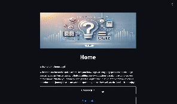

# <p align="center">Streamlit Quiz Application</p>
<p align="center">
    
</p>

Welcome to the Streamlit Quiz Application! This interactive platform allows users to take quizzes, add their own questions, and see their progress as they go. It is built using [Streamlit](https://streamlit.io/), making it easy to develop and deploy interactive web apps.

## ➤ Menu

* [➤ Project Structure](#-project-structure)
* [➤ How to Run](#-how-to-run)
* [➤ Requirements](#-requirements)
* [➤ Outputs](#-outputs)
* [➤ Evaluation Criteria](#-evaluation-criteria)
* [➤ Performance Metrics](#-performance-metrics)
* [➤ License](#-license)
* [➤ Author](#-author)

## Project Structure

This project includes the following main components:

- **Home page.py**: The main entry point of the application.
- **config**:
    - **data.json**: Stores the quiz questions.
    - **json_utils.py**: Utility functions for reading and writing JSON data.
- **pages**:
    - **Create a quiz.py**: Page for adding new questions to the quiz.
    - **Quiz.py**: Main quiz page where users answer questions.
- **quiz_models.py**: Contains Pydantic models for data validation.
- **requirements.txt**: Lists all Python dependencies.
- **README.md**: Documentation file.

## How to Run

1. Ensure Python is installed on your system.
2. Clone this repository to your local machine:
   ```bash
   git clone https://github.com/yourusername/streamlit-quiz-app.git
   cd streamlit-quiz-app
   ```
3. Create a virtual environment:
    ```bash
    python3 -m venv venv
    source venv/bin/activate  # On Windows: venv\Scripts\activate
    ```
4. Install the required dependencies:
    ```bash
    pip install -r requirements.txt
    ```
5. Run the main script to start the application:
    ```bash
    streamlit run Home\ page.py

## Outputs


The application provides various functionalities:

- Home Page: A starting page with options to create or launch a quiz.
- Create a Quiz: Users can add their own questions by filling out fields in a simple form.
- Take a Quiz: Users can answer questions, and if their score is greater than half the total number of questions, st.balloons() is triggered to celebrate.

<p align="center">  </p> <p align="center"><i>Application showing options and quiz interactions.</i></p>

## Evaluation Criteria

Individual project completed over two days.

Evaluation is based on:

- Adherence to the minimum required functionalities.
- Quality of the user interface.
- Code quality (readability, structure, and documentation).

## Performance Metrics

- Functional Requirements: All mandatory functionalities are implemented and working.
- User Interface: Intuitive and user-friendly design.
- Code Quality:
    - Structured and modular code.
    - Comprehensive documentation (docstrings and comments).
- Bonus: Additional features that are well-integrated.

## License

## Author

Khadija Aassi <a href="https://github.com/Khadaassi" target="_blank">  </a>
